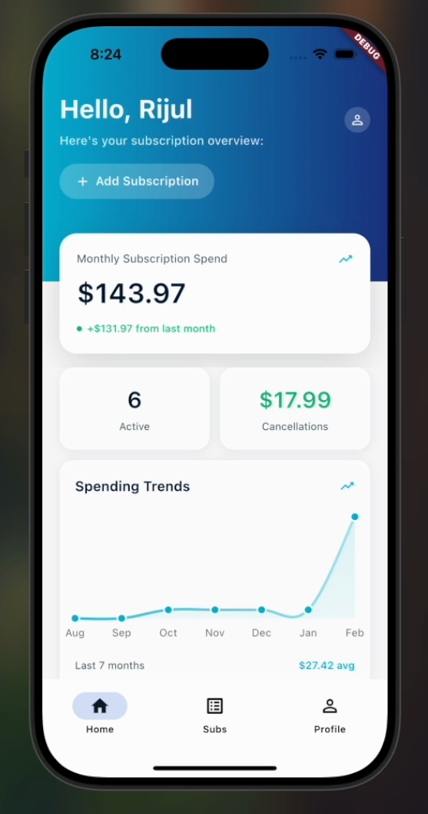
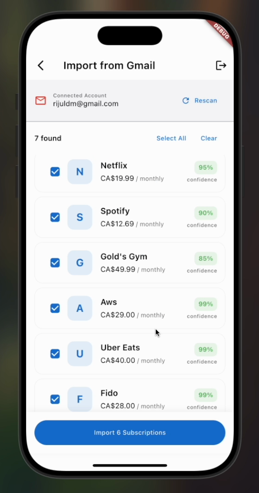
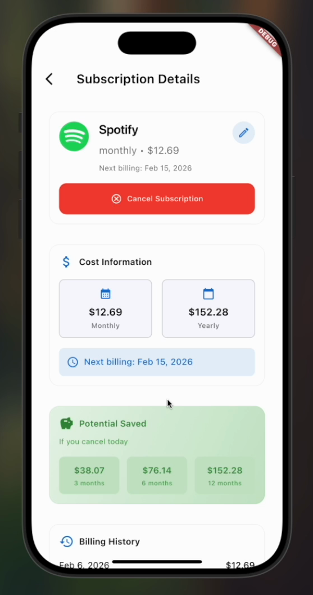
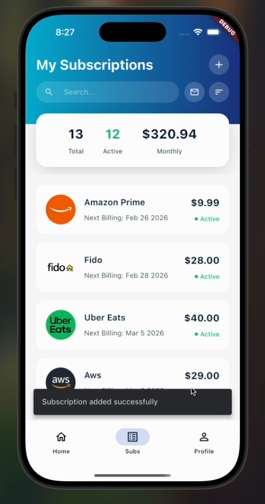

### Know what you're paying for.

**Dryft is a mobile app that finds, tracks, and helps you cancel your subscriptions — automatically.**

---

## The Problem

The average person pays for **10+ recurring subscriptions** and underestimates their monthly subscription spend by hundreds of dollars. Free trials roll into paid plans, prices creep up, and forgotten services keep charging — because no one reads their billing emails.

**Dryft turns your inbox into a subscription dashboard.** Connect your Gmail once, and Dryft finds every recurring charge, tells you exactly what you're spending, and shows you what you'd save by cancelling.

## 🎥 Demo

**[▶ Watch the full demo video](Final_Demo_Dryft.mp4)**

*(Click the link above — GitHub will play the video in the browser.)*

## Features

### One-tap Gmail import
Connect your Gmail account and Dryft scans your inbox for subscription and billing emails. A rule-based parsing engine matches sender, subject, and payment patterns to detect recurring charges - each detection comes with a **confidence score**, and you choose exactly which ones to import. No manual data entry.

### Spending dashboard
See your total monthly subscription spend at a glance, track month-over-month changes, and follow your **spending trend over time**. Dryft also totals up what you've saved through cancellations.

### One-click cancellation
No hunting through account settings, hidden cancellation pages, or retention flows. Every subscription has a **Cancel Subscription** button right on its detail page - one tap, and Dryft handles the rest, instantly updating your dashboard and savings totals.

### "What would I save?" cancellation insights
Every subscription gets a detailed view with monthly and yearly cost, next billing date, and full billing history - plus a **projected-savings breakdown** showing what cancelling today saves you over 3, 6, and 12 months.

### All your subscriptions, one list
A searchable, sortable list of every active and cancelled subscription with live status, price, and upcoming billing dates — so nothing renews without you knowing.

## 📱 Screenshots

| Dashboard | Gmail Import | Subscription Details | My Subscriptions |
|:---:|:---:|:---:|:---:|
|  |  |  |  |
| Monthly spend, trends & savings | Auto-detected subscriptions with confidence scores | Costs, billing history & cancellation savings | Search, sort & status at a glance |

## 🛠 How It's Built

| Layer | Technology |
|---|---|
| Mobile app | **Flutter** (iOS & Android from a single codebase) |
| Auth & data | **Supabase** (authentication, Postgres database) |
| Email import | **Gmail API** (OAuth) + rule-based email parsing engine |
| Detection | Pattern matching on senders, subjects & payment amounts, with per-match confidence scoring |

**How the import works:** after the user grants Gmail access via OAuth, Dryft scans billing-related emails and runs them through a parsing engine that recognizes recurring-payment patterns — subscription confirmations, receipts, renewal notices. Each candidate subscription is scored by confidence and presented to the user for review before anything is imported, keeping the user in control of their data.

## 👥 Team

Dryft was built as a startup venture by a small founding team. As co-founder, I led the product side — concept, user experience, and business strategy — working alongside our technical co-founder who built the app.

---

*Built with Flutter & Supabase · Dryft © 2026*

